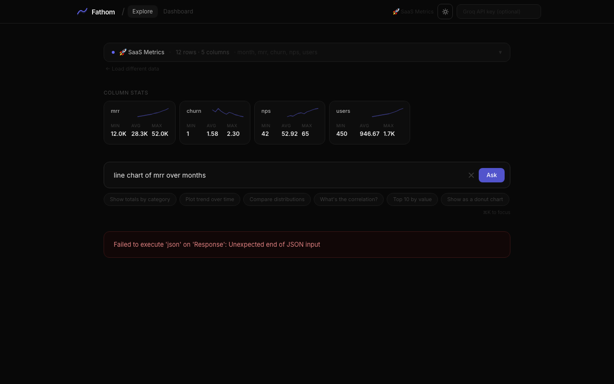

# DataDropAI

**Ask your data anything.** Drop in a CSV or Google Sheet, type a question in plain
English, and get a chart back in seconds — no formulas, no pivot tables, no setup.



## The idea

Spreadsheets make you know the answer's shape before you can ask for it — which chart,
which columns, which aggregation. DataDropAI takes the question instead. "Which region
grew fastest last quarter?" becomes a chart configuration, and the chart renders from
your data in the browser.

Your rows never leave the page. Only the **column names and types** are sent to the
model to plan the chart; the values stay client-side and are rendered locally.

## What it does

- **Load** a CSV, an Excel file, or a public Google Sheet — or start from a sample.
- **Ask** in plain English, and get follow-up suggestions for the next question.
- **Chart** as bar, line, pie, table, or heatmap, with reference lines and a palette picker.
- **Export** any chart as PNG, and keep a history strip of previous questions.
- **Dashboard** several charts at once, with fullscreen and light/dark themes.

## Stack

| Layer | Built with |
| --- | --- |
| UI | React 18, Vite 5, Tailwind 3 |
| Charts | Recharts 2, D3 7 (heatmaps) |
| Parsing | PapaParse 5, SheetJS |
| Export | html2canvas |
| Model | Groq `llama-3.3-70b-versatile` via a Vercel serverless function |

The API key lives in the serverless function, never in the browser.

## Running it

```bash
npm install
npm run dev
```

To enable the natural-language layer, set `GROQ_API_KEY` (free tier, no card required).
Without it, everything except question-asking still works — loading, charting, and export.

## Deploying

Vercel-ready as-is: `vercel.json` sets the build, SPA rewrites, and security headers.

```bash
vercel
vercel env add GROQ_API_KEY
```

## Full documentation

**[docs/README.md](docs/README.md)** — architecture, component tree, data flow, the LLM
prompt contract, state management, the chart system, security notes, and a full feature
reference, with 20 screenshots.
