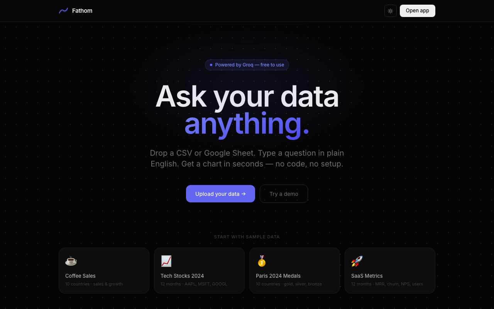
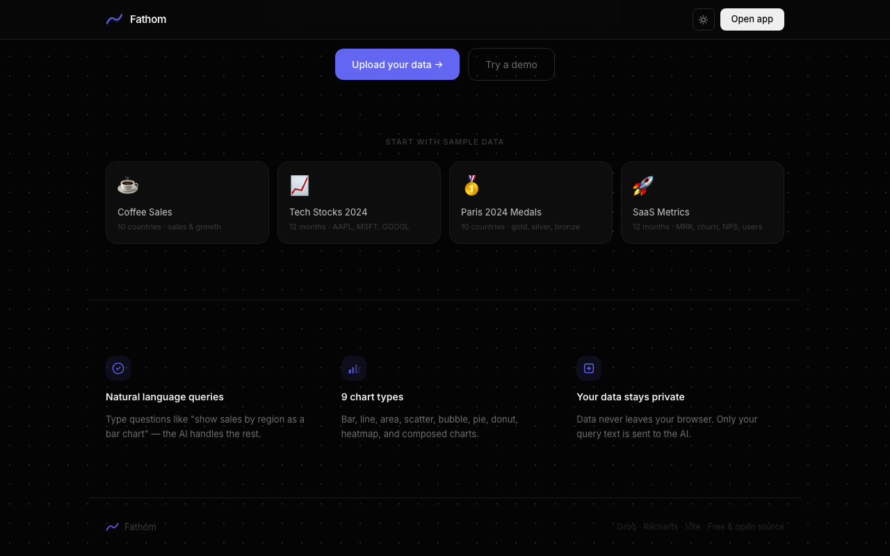
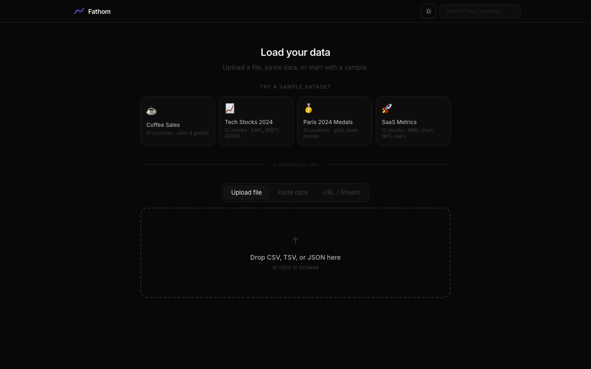
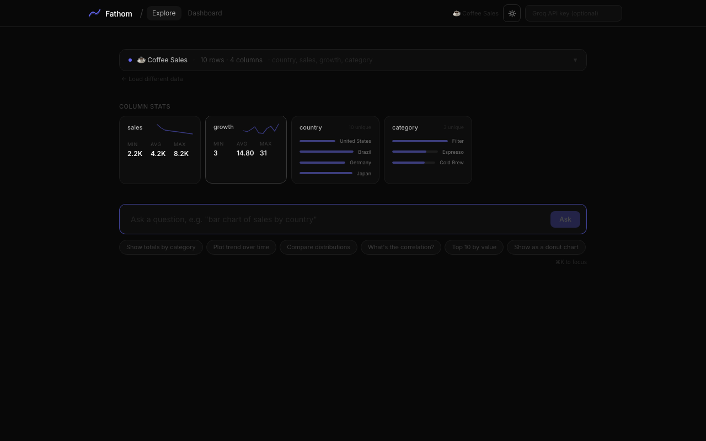
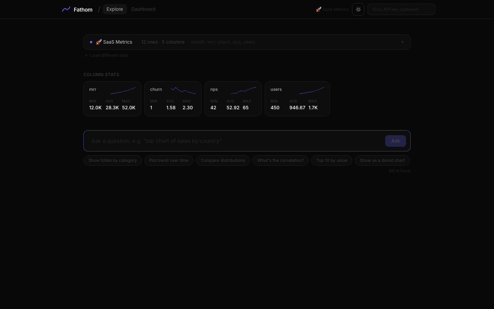
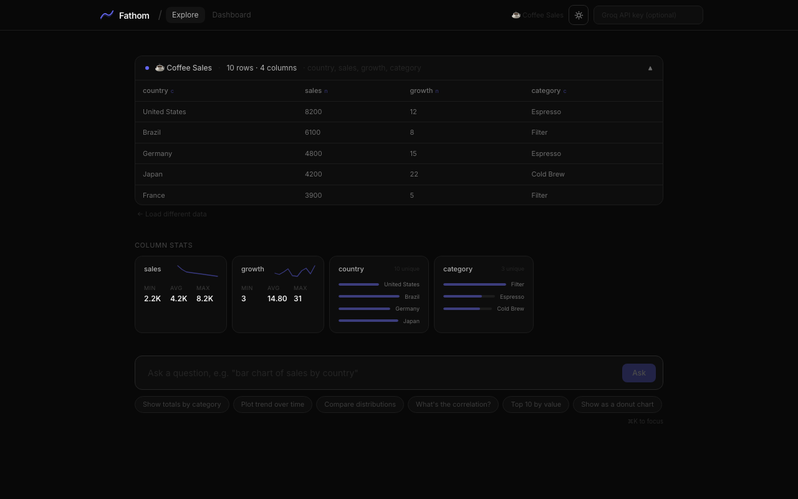
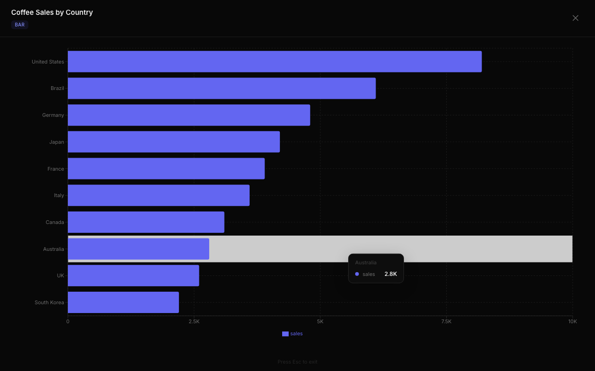
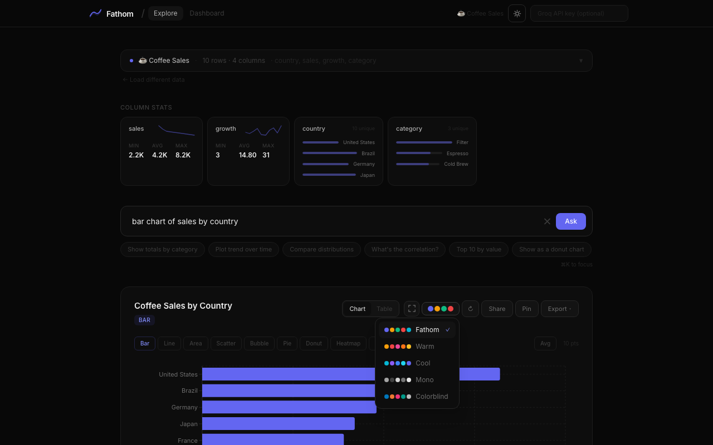
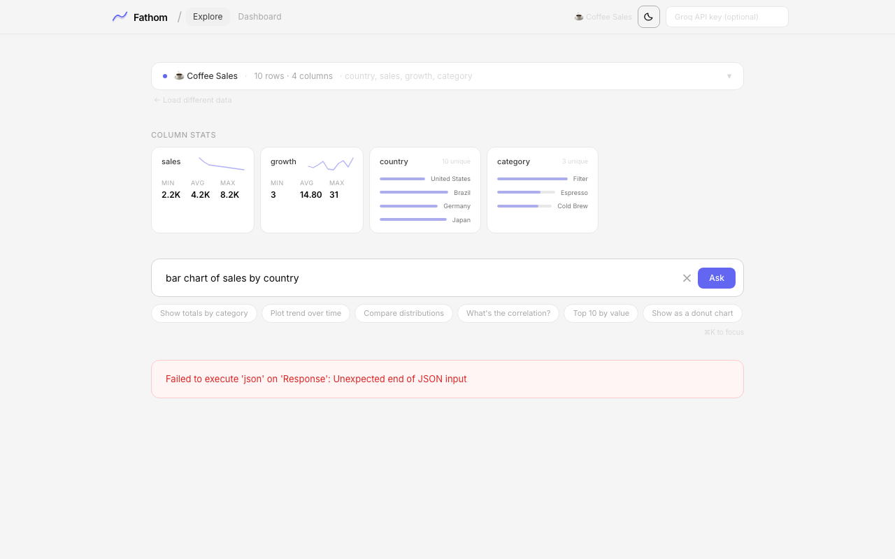
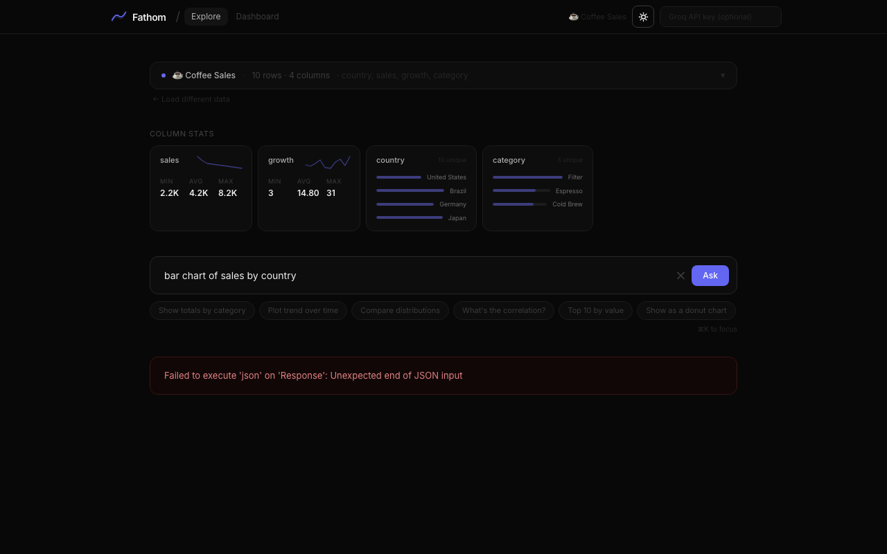

# Fathom — Documentation

> Ask your data anything. Drop a CSV or Google Sheet, type a question in plain English, get a chart in seconds — no code, no setup.

---

## Table of Contents

1. [Overview](#overview)
2. [Screenshots](#screenshots)
3. [Architecture](#architecture)
4. [Component Tree](#component-tree)
5. [Data Flow](#data-flow)
6. [LLM Integration](#llm-integration)
7. [State Management](#state-management)
8. [Chart System](#chart-system)
9. [Security](#security)
10. [Features Reference](#features-reference)
11. [Keyboard Shortcuts](#keyboard-shortcuts)
12. [Configuration & Deployment](#configuration--deployment)

---

## Overview

Fathom is a single-page React application that lets non-technical users explore tabular data through natural-language queries. It uses the Groq LLM API to convert plain-English questions into structured chart configurations, which are then rendered via Recharts.

**Stack at a glance:**

| Layer | Technology |
|-------|------------|
| UI framework | React 18 + Vite 5 |
| Styling | Tailwind CSS 3 + CSS custom properties |
| Charts | Recharts 2 |
| CSV parsing | PapaParse 5 |
| Heatmap rendering | D3 7 |
| PNG export | html2canvas 1 |
| LLM | Groq `llama-3.3-70b-versatile` |
| Backend | Vercel serverless function (Node.js ESM) |
| Hosting | Vercel |

**Key constraints:**
- Raw data never leaves the browser (not sent to LLM, not stored in localStorage)
- Only the query text + column schema are sent to the AI
- No database, no accounts, no backend state

---

## Screenshots

### Landing Page



The landing page (dark mode default) shows the hero headline, a pill badge indicating it's free-to-use, and two CTAs. A subtle dot-grid background and radial gradient glow add visual depth without distraction.



Below the hero, four built-in sample datasets are shown as interactive cards. Users can click one to jump straight into the app pre-loaded with data.

---

### Data Input



When entering the app without data, users see a data loading panel with three tabs: **Upload file** (drag-and-drop CSV/TSV/JSON), **Paste data**, and **URL / Sheets** (public Google Sheets or any CSV URL). Sample dataset shortcuts sit above the tabs.

---

### Column Stats Strip



After loading data, the Column Stats strip auto-generates a card for every column without any AI call:

- **Numeric columns** show min / avg / max values with a sparkline tracing the values in row order
- **Categorical columns** show the top 4 values as proportional bar charts with a unique-count badge

This gives an immediate data profile before running any query.



With a dataset that has many numeric columns (MRR, churn, NPS, users), all four columns each show a distinct sparkline revealing different trend shapes.

---

### Data Preview



Clicking the dataset row (which shows row count, column count, and column names) expands an accordion preview of the first 5 rows. The animation uses a CSS `max-height` transition for smoothness. Column type is shown as a single character (`n` = numeric, `c` = categorical, `d` = date).

---

### Chart View



A bar chart rendered in fullscreen mode. Charts with more than 9 data points automatically switch to a **horizontal layout** so labels remain readable. The custom tooltip shows the label and formatted value with tabular-numeric alignment.

---

### Chart Controls



Every chart card includes a **chart type switcher** — a horizontal scrollable row of pill buttons (Bar, Line, Area, Scatter, Bubble, Pie, Donut, Heatmap, Composed). Clicking a type instantly re-renders the chart without a new AI call.

The right side of the toolbar holds:
- **Chart / Table** toggle
- **Fullscreen** (or press `F`)
- **Color palette** picker (5 palettes)
- **↻ Regenerate** (re-run the query)
- **Share** (copies URL with base64-encoded chart)
- **Pin** (add to dashboard)
- **Export** dropdown (PNG, CSV, Copy as JSON)

---

### Light Theme



The entire UI responds to a dark/light toggle stored in localStorage. All colors use CSS custom properties, so Recharts elements, tooltips, borders, and surfaces all update consistently.

---

### History Strip



At the bottom of the explore view, the last 12 queries are shown as horizontal-scrolling cards. Each card shows the chart type badge, title, and the original query text. Clicking any card instantly restores that chart state.

---

## Architecture

```
/
├── src/
│   ├── App.jsx          # Entire frontend — 2,337 lines, single file
│   ├── main.jsx         # React root mount
│   └── index.css        # Tailwind imports + CSS custom properties (theme tokens)
├── api/
│   └── query.js         # Vercel serverless function — GROQ_API_KEY proxy
├── public/
├── docs/
│   ├── README.md        # This file
│   └── screenshots/     # Automated screenshots (Playwright)
├── vercel.json          # SPA rewrites + security headers
├── vite.config.js       # Vite + React plugin, no extras
├── tailwind.config.js   # Tailwind config
└── package.json
```

### File size philosophy

The entire frontend is intentionally one file (`src/App.jsx`). This avoids prop-drilling complexity from deeply nested components and makes the entire codebase readable in a single pass. There are no external state libraries, no routers, no component libraries beyond Recharts.

---

## Component Tree

```
App (root — all state lives here)
│
├── LandingPage              (page === 'home')
│   ├── ThemeToggle
│   └── [Sample cards]
│
└── App shell                (page === 'app')
    │
    ├── [Toast stack]        (fixed, bottom-right)
    ├── [Fullscreen overlay] (fixed, z-50)
    │
    ├── Header
    │   ├── Logo
    │   ├── [Explore / Dashboard tabs]
    │   ├── ThemeToggle
    │   └── [Groq API key input]
    │
    ├── Dashboard            (view === 'dashboard')
    │   └── ChartRenderer × N (pinned charts)
    │
    └── Explore              (view === 'explore')
        ├── DataInput            (!dataLoaded)
        │   └── [Upload / Paste / URL tabs]
        │
        ├── [Dataset header bar]  (dataLoaded)
        │   └── [Data preview accordion]
        │
        ├── StatsStrip
        │   ├── [Numeric cards + Sparkline]
        │   └── [Categorical cards + mini bars]
        │
        ├── [Rate-limit banner]
        │
        ├── [Query input bar]
        │   └── [AI suggestion chips]
        │
        ├── [Loading skeleton]
        ├── [Error banner]
        │
        ├── [Chart card]          (chartConfig set)
        │   ├── [Title + type badge]
        │   ├── [Toolbar: view toggle, fullscreen, PalettePicker, share, pin, export]
        │   ├── [Chart type switcher strip]
        │   ├── ChartErrorBoundary
        │   │   └── ChartRenderer
        │   │       ├── BarChart / LineChart / AreaChart
        │   │       ├── ScatterChart (scatter + bubble)
        │   │       ├── PieChart (pie + donut)
        │   │       ├── HeatmapChart (custom SVG via D3)
        │   │       └── ComposedChart
        │   ├── DataTable           (chartView === 'table')
        │   ├── [Insight callout]
        │   └── [Follow-up chips + refine input]
        │
        └── HistoryStrip
```

---

## Data Flow

### 1. Loading Data

```
User action (drop file / paste / URL / sample click)
    ↓
loadCSV(text)       PapaParse → clean rows
loadJSON(text)      JSON.parse → normalize to string values
loadURL(url)        fetch → detect format → route to above
loadSample(sample)  inline rows → stringify
    ↓
loadData(rows, label)
    ↓
inferColumns(rows)
    └── detectType(values[])   // 'numeric' | 'categorical' | 'date'
    ↓
setRows, setColumns, setDataLoaded(true)
    ↓
generateSuggestions(columns, rows)   // async, fires AI call
    └── Returns 5 dataset-specific question chips
```

### 2. Running a Query

```
User types question → presses Enter or clicks Ask
    ↓
runQuery(question)
    ↓
buildSystemPrompt(columns, rows)
    └── Sends: column schema + 5 sample rows
    ↓
queryLLM(messages, userKey?)
    ├── No key → POST /api/query  (server-side proxy)
    └── Key set → POST api.groq.com/openai/v1/chat/completions  (direct)
    ↓
JSON.parse(response)   // response_format: json_object enforced
    ↓
normalizeConfig(parsed, columns)
    └── resolveCol() — case-insensitive column name matching
    ↓
[optional] filter rows by config.filter
    ↓
aggregateData(rows, config, columns)
    └── Groups by xAxis, applies sum / avg / count / none
    └── pivotGroupBy() for grouped bar/line charts
    ↓
setChartConfig(config)
setChartData(processed)
setChartHistory([...])
```

### 3. Switching Chart Type (no AI)

```
User clicks type pill (e.g. "Line")
    ↓
switchChartType('line')
    ├── Adapts yAxis if needed (pie/donut → single)
    ├── Adapts axes for scatter/bubble (numeric only)
    └── Sets chartType, resets showAvgLine
    ↓
setChartConfig(newConfig)   // same data, new config
setChartId(prev + 1)        // forces ChartErrorBoundary reset
```

### 4. Sharing

```
shareChart()
    ↓
encodeShare({ config, data.slice(0,150), columns })
    └── JSON → TextEncoder → btoa → URL-safe base64
    ↓
clipboard.writeText(url + '?c=' + encoded)

// On load:
decodeShare(params.get('c'))
    └── Validates: chartType string, data array ≤5000, columns array
    ↓
Restores chart immediately
```

---

## LLM Integration

### System Prompt

The system prompt sent to `llama-3.3-70b-versatile` includes:

1. **Output schema** — exact JSON structure with all field names and allowed values
2. **Rules** — axis type constraints per chart type, aggregation logic, filter usage
3. **Dataset schema** — `column_name (type)` for every column
4. **Sample rows** — first 5 rows as JSON strings

Only the schema and sample rows leave the browser — never the full dataset.

### Response Schema

```json
{
  "chartType": "bar|line|area|scatter|bubble|pie|donut|heatmap|composed",
  "title": "Concise descriptive title",
  "xAxis": "exact column name",
  "yAxis": "exact column name OR array",
  "groupBy": "column name or null",
  "aggregation": "sum|avg|count|none",
  "colorBy": "column name or null",
  "filter": { "column": "name", "values": ["v1", "v2"] },
  "insight": "One sentence plain-English insight"
}
```

`response_format: { type: 'json_object' }` is enforced in every request, preventing markdown-wrapped or partial responses.

### Follow-up Context

When a follow-up question is submitted, the previous AI response is included as an `assistant` message in the conversation history, giving the model context to refine rather than restart.

---

## State Management

All state lives in the root `App` component. No external state library is used.

### Primary State

| State | Type | Purpose |
|-------|------|---------|
| `rows` | `Object[]` | Raw loaded data rows (never persisted) |
| `columns` | `{name, type}[]` | Inferred column schema |
| `dataLoaded` | `boolean` | Whether data is ready for querying |
| `dataLabel` | `string` | Display name shown in the header |
| `query` | `string` | Current query input value |
| `chartConfig` | `Object \| null` | LLM-returned chart configuration |
| `chartData` | `Object[]` | Aggregated/processed data for the chart |
| `chartId` | `number` | Bumped on every new chart to reset `ChartErrorBoundary` |
| `chartHistory` | `Object[]` | Last 12 chart states (config + data + query) |
| `pins` | `Object[]` | Pinned charts for the dashboard (max 10) |
| `view` | `'explore' \| 'dashboard'` | Current app view |
| `chartView` | `'chart' \| 'table'` | Chart vs tabular view toggle |
| `suggestions` | `string[]` | AI-generated question chips (fires once on data load) |
| `theme` | `'dark' \| 'light'` | Persisted to localStorage |
| `palette` | `string` | Active color palette key, persisted |
| `showAvgLine` | `boolean` | Average reference line toggle |
| `fullscreen` | `boolean` | Fullscreen overlay active |
| `apiKey` | `string` | Optional user-provided Groq key, persisted |
| `rateLimitEnd` | `number` | Timestamp when rate limit expires |
| `toasts` | `{id, message, type}[]` | Active toast notifications |

### Session Persistence

`localStorage` saves a session snapshot on every meaningful state change. **Raw rows are never saved** (privacy). On next load, the column schema, last chart, pinned charts, and history are restored — the user sees their previous state but must re-upload data to run new queries.

```
localStorage:
  fathom_session  →  { columns, dataLabel, chartConfig, chartData,
                       chartHistory[0..4], pins[0..9], query, palette }
  fathom_theme    →  'dark' | 'light'
  fathom_key      →  Groq API key (if user provided one)
```

---

## Chart System

### ChartRenderer

`ChartRenderer` is a pure rendering component that takes `{ config, data, columns, height, colors, showAvgLine }` and returns the correct Recharts component tree. It has no state.

```
chartType  →  component
─────────────────────────────────────────────────────
'bar'      →  BarChart (horizontal if data.length > 9)
'line'     →  LineChart (supports groupBy via pivot)
'area'     →  AreaChart (gradient fill per series)
'scatter'  →  ScatterChart
'bubble'   →  ScatterChart + ZAxis (size encoding)
'pie'      →  PieChart
'donut'    →  PieChart (innerRadius: 80)
'heatmap'  →  HeatmapChart (custom D3 SVG)
'composed' →  ComposedChart (bar + lines)
```

### Color Palettes

Five palettes are available. Colors within each palette are ordered so that the first N items always have maximum perceptual contrast — a 2-series comparison always gets the most distinct pair.

| Palette | Colors (first 4) | Use case |
|---------|-----------------|---------|
| **Fathom** | Indigo, Amber, Emerald, Red | Default — warm/cool balance |
| **Warm** | Amber, Red, Pink, Orange | Warm tonality |
| **Cool** | Cyan, Violet, Blue, Sky | Cool tonality |
| **Mono** | Gray scale | Print / minimal |
| **Colorblind** | Blue, Orange, Magenta, Teal | Accessibility |

### HeatmapChart

The heatmap is the only chart type not built on Recharts. It uses D3's `scaleSequential(d3.interpolateBlues)` to map values to a blue color gradient, and renders a raw SVG with `<rect>` cells and text labels. Cell size adapts to the number of X-axis values to fit the container.

### Animation

| Element | Duration | Easing |
|---------|----------|--------|
| Bar | 500ms | ease-out |
| Line / Area | 700ms | ease-in-out |
| Pie / Donut | 700ms | ease-in-out |

### ChartErrorBoundary

Every chart is wrapped in a class-based error boundary. The `key` prop is tied to `chartId` (bumped on every new chart), which resets the boundary on each query — preventing a failed chart from blocking future renders.

---

## Security

### API Proxy (`api/query.js`)

The serverless function acts as a proxy to keep `GROQ_API_KEY` server-side.

**Rate limiting** — 20 requests/minute per IP (in-memory, resets on cold start):
- IP resolved from `x-real-ip` (Vercel edge header — not spoofable by clients)
- Falls back to `x-forwarded-for` last entry, then socket address

**CORS** — Locked to `ALLOWED_ORIGIN` env var. If unset (dev mode), reflects the request origin as a dev-friendly fallback.

**Input validation:**
- `messages` must be a non-empty array with 1–10 items
- Each message must have a role in `{system, user, assistant}` and a string content
- Total combined content length capped at 20,000 characters

**Upstream timeout** — AbortController cancels the Groq request after 25 seconds, returning 504.

**Error handling** — Raw error details are logged server-side only; clients receive generic `"Internal server error"` messages.

### Security Headers (`vercel.json`)

```
X-Content-Type-Options: nosniff
X-Frame-Options: DENY
Referrer-Policy: strict-origin-when-cross-origin
Permissions-Policy: camera=(), microphone=(), geolocation=()
```

### Data Privacy

- Raw data rows are never sent to the LLM — only column names, types, and 5 sample rows
- Raw rows are never written to `localStorage`
- No analytics, no tracking, no external requests except the LLM proxy

---

## Features Reference

### Data Input

| Feature | Details |
|---------|---------|
| CSV upload | Drag-and-drop or click-to-browse; PapaParse handles delimiter detection |
| TSV / TXT | Detected automatically by PapaParse |
| JSON upload | Top-level array, or first array value of an object |
| Paste data | Textarea — detects JSON vs CSV by first character |
| URL / Google Sheets | Fetches CSV directly; transforms Google Sheets URL to export format |
| Sample datasets | Coffee Sales, Tech Stocks, Paris 2024 Medals, SaaS Metrics |

### Query System

| Feature | Details |
|---------|---------|
| Natural language | Full sentence or telegraphic queries both work |
| AI suggestions | 5 dataset-specific chips generated on first load |
| Default chips | 6 fallback chips shown while AI suggestions load |
| Follow-up chips | 3 smart chips per chart (type alt, group by, sort/top 10) |
| Refine input | Freeform text box below each chart for follow-up queries |
| Conversation context | Previous chart config sent as assistant turn for follow-ups |
| Regenerate | ↻ button re-runs the same query |

### Chart Features

| Feature | Details |
|---------|---------|
| 9 chart types | Bar, Line, Area, Scatter, Bubble, Pie, Donut, Heatmap, Composed |
| Instant type switching | Click any type pill — no new AI call required |
| Average reference line | Toggle `Avg` button on bar/line/area/composed charts |
| Horizontal bar auto-switch | Bar charts with >9 items automatically go horizontal |
| Custom tooltip | Themed, tabular-numeric, shows label + color swatch + value |
| Chart / Table toggle | Switch between visualization and sortable/searchable data table |
| Fullscreen mode | Full viewport chart with Esc to exit (also press `F`) |
| Animation | Entrance animations on all chart elements |
| Grouped charts | `groupBy` creates multi-series with distinct colors per group |

### Export & Sharing

| Feature | Details |
|---------|---------|
| PNG export | html2canvas, 2× resolution, optional "Built with Fathom" watermark |
| CSV export | Chart data (post-aggregation) as downloadable CSV |
| Copy as JSON | Chart data copied to clipboard as formatted JSON |
| Share chart | Base64 URL encodes config + up to 150 data rows |
| Share dashboard | Base64 URL encodes all pinned charts |

### Dashboard

| Feature | Details |
|---------|---------|
| Pin charts | Save any chart to a persistent 2-column grid dashboard |
| Max pins | 10 charts (each stores up to 500 rows) |
| Export report | html2canvas PNG of the entire dashboard grid |
| Share dashboard | URL-shareable |

### UI / UX

| Feature | Details |
|---------|---------|
| Dark / Light theme | Toggled via header button, persisted to localStorage |
| 5 color palettes | Fathom, Warm, Cool, Mono, Colorblind |
| Stats strip | Auto-computed min/avg/max + sparkline for every numeric column; top categories for categorical columns |
| Data preview accordion | Smooth CSS max-height transition |
| History strip | Last 12 charts as scrollable cards, click to restore |
| Loading steps | 3-phase indicator: "Analyzing…" → "Asking AI…" → "Building chart…" |
| Rate limit UI | Progress bar countdown with exact seconds remaining |
| Toast notifications | Slide-in confirmation for pin, copy, export actions |
| Session restore | Columns, chart, history, and pins restore across page reloads |

---

## Keyboard Shortcuts

| Shortcut | Action |
|----------|--------|
| `⌘K` / `Ctrl+K` | Focus query input and scroll it into view |
| `Enter` | Submit query (when query input is focused) |
| `F` | Enter fullscreen (when not in a text input and chart is visible) |
| `Esc` | Exit fullscreen; unfocus input |

---

## Configuration & Deployment

### Environment Variables

| Variable | Required | Description |
|----------|----------|-------------|
| `GROQ_API_KEY` | Yes (server) | Groq API key — set in Vercel project settings, never in code |
| `ALLOWED_ORIGIN` | Recommended | Restricts CORS to your deployment URL, e.g. `https://fathom.yourdomain.com` |

### Local Development

```bash
npm install
npm run dev         # starts Vite dev server at http://localhost:5173
```

In dev mode, the `/api/query` serverless function does **not** run (Vite doesn't emulate Vercel serverless). To use the app locally, add your Groq key in the optional key field in the app header — queries will go directly to `api.groq.com` from the browser.

To test the serverless function locally:
```bash
npm install -g vercel
vercel dev          # runs both Vite and the /api/* functions
```

### Deploying to Vercel

```bash
vercel deploy
```

Set `GROQ_API_KEY` and `ALLOWED_ORIGIN` in your Vercel project's environment variables. The `vercel.json` rewrites handle SPA routing — all non-API paths serve `index.html`.

### Build

```bash
npm run build       # outputs to /dist
npm run preview     # serve the built output locally
```

The production bundle is ~897 KB (244 KB gzip), dominated by Recharts and D3.

---

## Project Stats

| Metric | Value |
|--------|-------|
| Frontend lines of code | 2,337 (single file) |
| React components | 15 |
| Pure utility functions | 12 |
| Chart types supported | 9 |
| Runtime dependencies | 5 (React, Recharts, D3, PapaParse, html2canvas) |
| Backend lines of code | 109 (single serverless function) |
| Bundle size (gzip) | 244 KB |

---

*Documentation generated from source at commit HEAD · Screenshots captured with Playwright against live dev server.*
